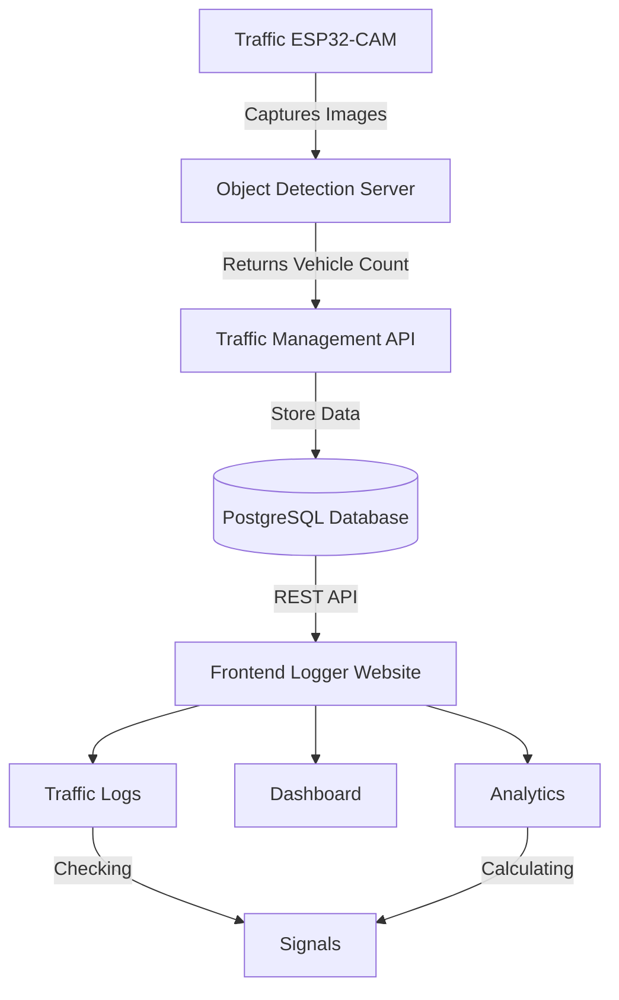

# Traffic and Vehicle Management using Object Detection

This is a system which uses traffic signal cameras for object detection and based on the vehicles of the car it will manage the traffic signals for proper management of time.

**Features:**

1. YOLOv8n based Vehicle Object Detection on the roads and intersections.
2. FastAPI server for fast data transfer from database to services.
3. React based frontend for logging, analystics and visualization of traffic.

## YOLOv8n Object Detection

### Testing and Recording Application

YOLOv8n model gets the things done so we don't need a latest or heavier model. The applications have the responsibilty to recognize these following objects:

```py
2: "car", 3: "motorcycle", 5: "bus", 7: "truck"
```

In the [`yolo/app.py`](./ml/yolo/app.py) we are testing the model in a stream of images from a highway and storing the outputs into a SQLite Database [`vehicle_detection.db`](./ml/yolo/vehicle_detection.db).

### API

We are using a FastAPI-RestAPI which is running a yolo model in the route `/detect-vehicles` which takes a parameter and an image from the camera to give the list of vehicles on the road.

To test the API we have a python script to simulate the reallife senario of traffic signal camera. The script sends the api endpoint a camera_id and an image every 2 second. The data is saved in a SQLite database.

[`Object Detection API`](./server/object_detection/main.py)
[`Testing Script`](./server/demo_test_ip_camera/main.py)

## Flow Architecture



## Local Setup

**Clone the repository**:

```sh
https://github.com/debarshee2004/traffic-and-vehicle-management.git
cd traffic-and-vehicle-management
```

**Create a python environment**:

```sh
uv venv
.venv\Scripts\Activate.ps1
uv add
```

---
