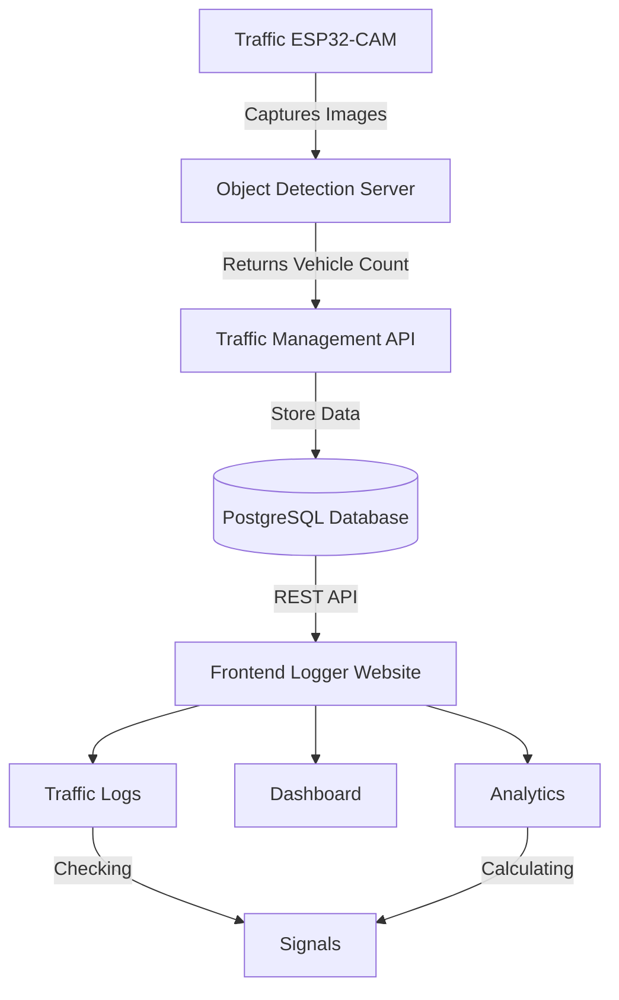

# Traffic and Vehicle Management using Object Detection

This is a system which uses traffic signal cameras for object detection and based on the vehicles of the car it will manage the traffic signals for proper management of time.

**Features:**

1. YOLOv8n based Vehicle Object Detection on the roads and intersections.
2. FastAPI server for fast data transfer from database to services.
3. React based frontend for logging, analystics and visualization of traffic.

## Flow Architecture

