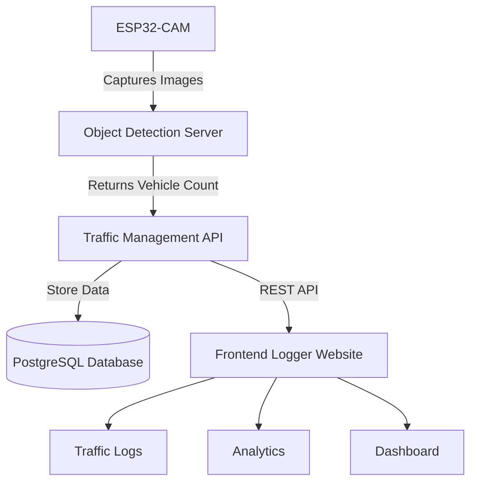

# Traffic and Vehicle Management

```mermaid
flowchart TD
    A[ESP32-CAM] -->|Captures Images| B[Object Detection Server]
    B -->|Returns Vehicle Count| C[Traffic Management API]
    
    C -->|Store Data| D[(PostgreSQL Database)]
    C -->|REST API| E[Frontend Logger Website]
    
    E --> F[Traffic Logs]
    E --> G[Analytics]
    E --> H[Dashboard]
```
